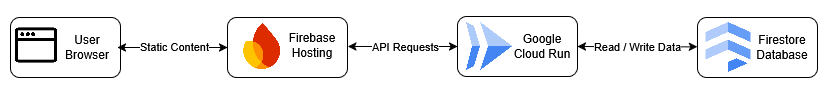

# Cloud Resume

## Overview

Cloud Resume is a serverless web application hosted on Google Cloud Platform.
The frontend is served through Firebase Hosting, while a Cloud Function
provides a visitor counter backed by Firestore. Infrastructure is managed
through Terraform and deployments are automated using GitHub Actions.

Live Demo: [resume-497517.web.app](https://resume-497517.web.app)

## Architecture

### Architecture Diagram



### Request Flow

1. User accesses resume website on Firebase Hosting.
2. JavaScript sends request to Cloud Function.
3. Cloud Function reads and updates visitor count in Firestore.
4. Updated count is returned to the frontend.
5. Visitor count is displayed on the page.

## Services Used

### Core Services

| Service          | Purpose                                           |
| ---------------- | ------------------------------------------------- |
| Firebase Hosting | Hosts the static content                          |
| Cloud Functions  | Provides a serverless API for the visitor counter |
| Firestore        | Stores the visitor count data                     |

### Security & Access Control

| Service   | Purpose                                |
| --------- | -------------------------------------- |
| Cloud IAM | Manages permissions and service access |

### Infrastructure

| Tool      | Purpose                                   |
| --------- | ----------------------------------------- |
| Terraform | Provisions and configures cloud resources |

### CI/CD

| Tool           | Purpose                                           |
| -------------- | ------------------------------------------------- |
| GitHub Actions | Automates frontend deployment to Firebase Hosting |

## Project Structure

```
.
├── frontend/          # Static website files
├── functions/         # Cloud Function source code
├── terraform/         # Infrastructure as Code
├── .github/workflows/ # CI/CD pipelines
└── README.md          # Project documentation
```

## Future Improvements

- Backend CI/CD pipeline
- Testing
- Custom domain
- Rate limiting
- Monitoring and logging

## License

This project is licensed under the [MIT License](LICENSE).
